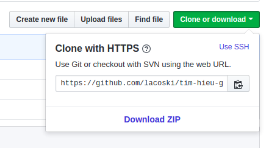

# Sử dụng Git cơ bản
---
## 1. Cài đặt Git
### 1.1 Cài đặt Git trên Ubuntu
```
apt-get install git -y
```
### 1.2 Cài đặt trên CentOS/RHEL
```
yum install git -y
```

## 2. Thiết lập chứng thực cá nhân
### 2.1 Cấu hình thiết lập tên, Email
```
git config --global user.name "thanhba"
git config --global user.email "thanh@gmail.com"
```
### 2.2 Tự lưu passwd Github Repo sau commit đầu
```
git config --global credential.helper cache
```
### 2.3 Kiểm tra kết quả
```
lacoski@lacoski-PC:~$ cat ~/.gitconfig
[user]
	email = thanh@gmail.com
	name = thanhba
[credential]
	helper = cache

lacoski@lacoski-PC:~$ git config --list
user.email=thanh@gmail.com
user.name=thanhba
credential.helper=cache
```

## 3. Thiết lập repository
> Repository (kho chứa) là nơi lưu trữ mã nguồn và người khác có thể sao chép (clone) lại mã nguồn để làm việc.

__Repository có hai loại:__
- Local Repository (Kho chứa trên máy cá nhân)
- Remote Repository (Kho chứa trên một máy chủ từ xa).

## 3.1 Tạo Local Repository
__Bước 1: Truy cập thư mục lưu các Git Repo__
```
cd [đường dẫn]
```
__Bước 2: Tạo Repo local__
```
git init [tên repo]
```
VD:
```
$ git init git_example
Initialized empty Git repository in /home/lacoski/git_example/.git/
```

> Truy cập git repo vừa tạo sẽ thấy thư mục `.git`.

> '.git' là thư mục ẩn chứa các thiết lập về Git cũng như lưu lại toàn bộ thông tin về kho chứa


## 3.2 Tạo Remote Repository
> Sử dụng Github làm repo remote, truy cập chia sẻ từ xa

> Cách tạo tự tìm hiểu theo giao diện Git cung cấp

__Để clone repo từ xa__
```
git clone [repo link]
```
> Mỗi khi tạo 1 Repo trên Linux sẽ nhận được 1 Repo link riêng



__Commit và update Remote Repo__
```shell
lacoski@lacoski-PC:~/GitRepo/tim-hieu-git$ git add .

lacoski@lacoski-PC:~/GitRepo/tim-hieu-git$ git commit -m "init repo"
[master 9ec710b] update
 3 files changed, 8 insertions(+)
 create mode 100644 docs/git-remote-repo-origin.md
 create mode 100644 images/git-clone-1.png

lacoski@lacoski-PC:~/GitRepo/tim-hieu-git$ git push origin master
Counting objects: 7, done.
Delta compression using up to 4 threads.
Compressing objects: 100% (6/6), done.
Writing objects: 100% (7/7), 19.70 KiB | 0 bytes/s, done.
Total 7 (delta 3), reused 0 (delta 0)
remote: Resolving deltas: 100% (3/3), completed with 3 local objects.
To https://github.com/lacoski/tim-hieu-git.git
   dd95116..9ec710b  master -> master

```
> Xem thêm các docs sau để biết thêm chi tiết
