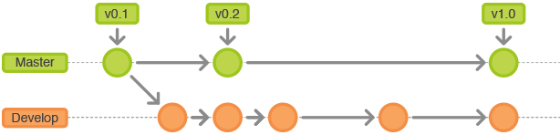
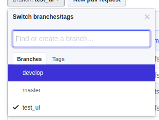

# Branch – Làm việc với nhánh
---
## Đặt vấn đề
Trong quá trình phát triển sản phẩm, sẽ nhiều thành viên đồng thời tiến hành thêm chức năng hay là tiến hành chỉnh sửa lỗi cùng một lúc. Việc đó nhiều khi sẽ dẫn đến xung đột nếu có nhiều hơn 1 người giải quyết 1 vấn đề chung.

Vì vậy để hỗ trợ quản lý phiên bản hay phát triển chức năng song song, Git cung cấp tính năng với tên gọi là là `branch`.

## Cơ bản về Branch
__Branch__ dùng để phân nhánh và ghi lại luồng làm việc trong git.

`Branch` đã phân nhánh sẽ không ảnh hưởng đến branch khác nên có thể tiến hành nhiều thay đổi đồng thời trong cùng 1 repository.

Khi khởi tạo repository hoặc clone một repository, sẽ có một nhánh (branch) chính tên là `master` (có thể hiểu master là thân cây). Đây là branch chứa toàn bộ các mã nguồn chính trong repository.

> Đây cũng chính là tham số khi ta push lên repo theo cách đơn giản: `git push origin master`



VD:

Khi ta có 1 vấn đề cần đẩy lên repository mà không muốn làm ảnh hưởng tới branch `master` thì ta sẽ tạo 1 branch `develop` để thay thế.

Từ đó các thay đổi trên branch `master`, branch `develop` sẽ diễn ra độc lập không ảnh hương tới nhau

Ta sẽ thực hiện lệnh `checkout` vào các branch để chuyển môi trường mã nguồn hiện hành sang môi trường mã nguồn branch mong muốn (working tree)

## HEAD – con trỏ vị trí
Trong Git, từ khóa HEAD sẽ tượng trưng cho con trỏ chỉ cho ta biết đang nằm ở đâu.

__Sử dụng git lg__
```shell
lacoski@lacoski-PC:~/GitRepo/tim-hieu-git$ git lg
* 28b545d - (HEAD -> master, origin/master) git thao tac repo (33 minutes ago) <thanh1996>
* 7bf0545 - git thao tac repo (35 minutes ago) <thanh1996>
* 881c0ce - update (66 minutes ago) <thanh1996>
* 9ec710b - update (68 minutes ago) <thanh1996>
* dd95116 - docs (3 hours ago) <thanh1996>
* 4b2a004 - update (3 hours ago) <thanh1996>
* ba6963f - update (3 hours ago) <thanh1996>
* c460a31 - git commit staging area (3 hours ago) <thanh1996>
* 31be675 - git basic (4 hours ago) <thanh1996>
* dd0777c - update (4 hours ago) <thanh1996>
* c84b70c - update (4 hours ago) <thanh1996>
* c548b2f - update docs (4 hours ago) <thanh1996>
* 0de781f - git overview (4 hours ago) <thanh1996>
* 185f4a0 - init repo (5 hours ago) <thanh1996>
```
> Đâu là tùy chọn riêng, xem lại docs (git log)

__Đọc tập tin `.git/HEAD`__
```shell
$ cat .git/HEAD
ref: refs/heads/master
```
__Dùng git status__
```shell
$ git status

On branch master
Your branch is up-to-date with 'origin/master'.
nothing to commit, working directory clean
```

## Cách tạo một branch
__Liệt kế các branch đang có trên working tree__
```
$ git branch
```
__Cú pháp tạo thêm branch__
```
$ git branch develop
```

VD:
```shell
lacoski@lacoski-PC:~/GitRepo/tim-hieu-git$ git branch
* master
lacoski@lacoski-PC:~/GitRepo/tim-hieu-git$ git branch develop
lacoski@lacoski-PC:~/GitRepo/tim-hieu-git$ git branch
  develop
* master
```

## Checkout một branch
__Cú pháp__
```shell
git checkout [tên_branch]
```

VD: Chuyển đổi giữa 2 nhánh
```shell
lacoski@lacoski-PC:~/GitTest/test-git-1$ git status
On branch master
Your branch is up-to-date with 'origin/master'.
nothing to commit, working directory clean

lacoski@lacoski-PC:~/GitTest/test-git-1$ git branch
  develop
* master

lacoski@lacoski-PC:~/GitTest/test-git-1$ git checkout develop
Switched to branch 'develop'

lacoski@lacoski-PC:~/GitTest/test-git-1$ git branch
* develop
  master
```

VD: Thay đổi môi trường các nhánh
> Nhánh master chứa: readme.md

> Nhánh develop chứa: readme.md branch.md develop.md

```shell
# Tại nhánh master
lacoski@lacoski-PC:~/GitTest/test-git-1$ git checkout master
Switched to branch 'master'
Your branch is up-to-date with 'origin/master'.

lacoski@lacoski-PC:~/GitTest/test-git-1$ ls
readme.md

# Tại nhánh develop
lacoski@lacoski-PC:~/GitTest/test-git-1$ git checkout develop
Switched to branch 'develop'

lacoski@lacoski-PC:~/GitTest/test-git-1$ ls
branch.md  develop.md  readme.md
```

__Commit nhánh lên Remote repo__

Thực hiện các bước sau:
- `checkout` sang nhánh cần commit
- `Push` với tên nhánh

VD:
```shell
lacoski@lacoski-PC:~/GitTest/test-git-1$ git checkout develop
Switched to branch 'develop'

lacoski@lacoski-PC:~/GitTest/test-git-1$ git status
On branch develop
nothing to commit, working directory clean

lacoski@lacoski-PC:~/GitTest/test-git-1$ git push origin develop
Counting objects: 4, done.
Delta compression using up to 4 threads.
Compressing objects: 100% (2/2), done.
Writing objects: 100% (4/4), 337 bytes | 0 bytes/s, done.
Total 4 (delta 0), reused 0 (delta 0)
To https://github.com/MasterNetworkTLU/test-git-1.git
 * [new branch]      develop -> develop
```

## Gộp dữ liệu từ một branch
Tại thời điểm ta muốn sử dụng các thay đổi ở tại branch A nào đó áp dụng cho master, ta sẽ sử dụng lệnh `git merge` để chuyển dữ liệu từ một branch A nào đó về branch ta đang trỏ đến (branch hiện hành).

> Lưu ý: branch cần chuyển về đã được commit.

VD:
```shell
lacoski@lacoski-PC:~/GitTest/test-git-1$ git checkout master
Switched to branch 'master'
Your branch is up-to-date with 'origin/master'.

lacoski@lacoski-PC:~/GitTest/test-git-1$ git merge develop
Updating 09c13c7..d2c9333
Fast-forward
 branch.md  | 1 +
 develop.md | 1 +
 2 files changed, 2 insertions(+)
 create mode 100644 branch.md
 create mode 100644 develop.md

lacoski@lacoski-PC:~/GitTest/test-git-1$ ls
branch.md  develop.md  readme.md
```

## Xóa branch
__Cú pháp__
```
git branch -d [tên_branch]
```
VD:
```shell
$ git branch -d develop
Deleted branch develop (was 8c68896)
```

## Làm việc trên nhiều Remote Repo
> Làm việc với nhiều Repo, phân nhánh không làm ảnh khi pull từ nhánh khác

__Add remote branch__
```shell
$ git remote add inuit https://github.com/csswizardry/inuit.css

$ git remote -v
inuit	https://github.com/inuitcss/inuitcss.git (fetch)
inuit	https://github.com/inuitcss/inuitcss.git (push)
origin	https://github.com/MasterNetworkTLU/test-git-1.git (fetch)
origin	https://github.com/MasterNetworkTLU/test-git-1.git (push)
```

__Xem toàn bộ nhánh trên Remote repo__
```shell
$ git remote show inuit

* remote inuit
  Fetch URL: https://github.com/inuitcss/inuitcss.git
  Push  URL: https://github.com/inuitcss/inuitcss.git
  HEAD branch: develop
  Remote branches:
    develop      new (next fetch will store in remotes/inuit)
    master       new (next fetch will store in remotes/inuit)
    tkt-0358-kss new (next fetch will store in remotes/inuit)
    v7.0.0       new (next fetch will store in remotes/inuit)
  Local refs configured for 'git push':
    develop pushes to develop (local out of date)
    master  pushes to master  (local out of date)
```

__Tạo mới branch__
```
$ git branch test_ui
$ git checkout test_ui

Switched to branch 'test_ui'
```

__Pull branch remote về branch repo hiện tại__
```shell
$ git pull inuit v7.0.0
warning: no common commits
remote: Counting objects: 2015, done.
remote: Compressing objects: 100% (6/6), done.
remote: Total 2015 (delta 1), reused 3 (delta 1), pack-reused 2008
Receiving objects: 100% (2015/2015), 342.79 KiB | 143.00 KiB/s, done.
Resolving deltas: 100% (1296/1296), done.
From https://github.com/inuitcss/inuitcss
 * branch            v7.0.0     -> FETCH_HEAD
 * [new branch]      v7.0.0     -> inuit/v7.0.0
Merge made by the 'recursive' strategy.
 .editorconfig                                 |   12 +
```

__Commit trên nhánh `test_ui`__
```shell
$ git commit -m "test remote"

On branch test_ui
nothing to commit, working directory clean
```

__Push lên origin branch `test_ui`__
```shell
$ git push origin test_ui
Counting objects: 2017, done.
Delta compression using up to 4 threads.
Compressing objects: 100% (706/706), done.
Writing objects: 100% (2017/2017), 342.06 KiB | 0 bytes/s, done.
Total 2017 (delta 1299), reused 2012 (delta 1296)
remote: Resolving deltas: 100% (1299/1299), done.
To https://github.com/MasterNetworkTLU/test-git-1.git
 * [new branch]      test_ui -> test_ui
```



## Nguồn

https://thachpham.com/tools/git-branch-ky-thuat-phan-nhanh.html
