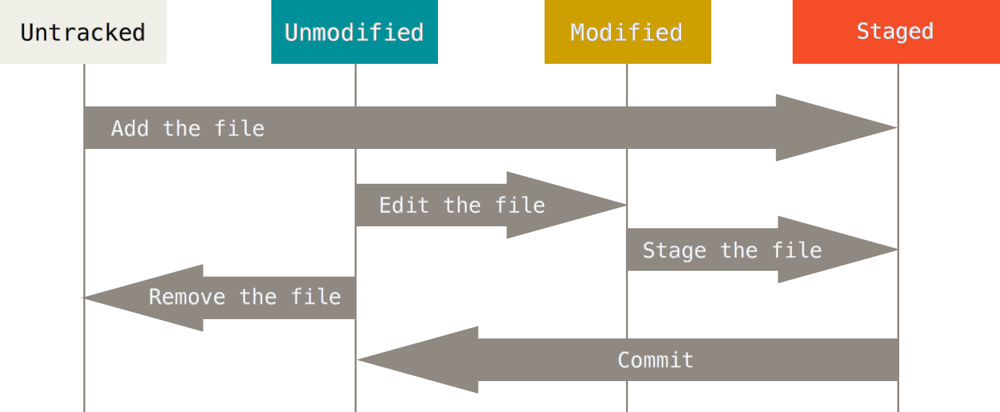

# Git commit và staging area
---
## Cơ bản Staging Area
__Staging Area__ là khu vực chuẩn bị cho quá trình commit.

Với Hệ thống quản lý phiên bản (Version Control System) quản lý dữ liệu tại 2 nơi:
- Thư mục đang làm việc trên máy tính (working tree)
- Kho chứa mã nguồn (repository) (ví dụ như kho chứa trên Github).

Git bổ sung thêm một lựa chọn:
- Khu vực trung gian gọi là Staging Area
> Đây là 1 đặc điểm chính của Git

`Staging Area` là khu vực lưu trữ những thay đổi trên tập tin so sánh giữa repo chính và repo clone trước `commit`

Khi `commit` tập tin thì tập tin đó phải nằm trong Staging Area. Một tập tin khi nằm trong Staging Area sẽ có trạng thái là Stagged (xem thêm ở dưới).


Để đưa file vào Staging Area, sử dụng lệnh:
```
git add [tên_file]
```

## Cơ bản về Commnit, cách hoạt động
`Commit` là chỉ thị trên Git, lưu lại bản chụp (snapshot) các sự thay đổi trong thư mục làm việc, và các tập tin và thư mục được thay đổi đã phải nằm trong Staging Area.

Mỗi `commit` sẽ được lưu lại lịch sử chỉnh sửa của mã nguồn kèm theo tên và địa chỉ email của người commit.

Ngoài ra Git cho phép khôi phục lại tập tin trong lịch sử commit, cho phép phân nhánh (branch).

__Chỉ thị commit__

```
git commit -m [Lời nhắn]
```

### Trạng thái chỉ thị Commit
__Git có hai loại trạng thái chính:__
- Tracked – Là tập tin đã được đánh dấu theo dõi trong Git.
 Trạng thái Tracked sẽ có thêm các trạng thái:
 - Unmodified (chưa chỉnh sửa gì)
 - Modified (đã chỉnh sửa)
 - Staged (đã sẵn sàng để commit).

- Untracked – Là tập tin không muốn làm việc với nó trong Git.



__Untracked__

Xuất hiện khi tạo mới hoặc thêm vào một tập tin mới vào trong thư mục repo đang làm việc. Nó sẽ ở trạng thái Untracked.

VD:
```shell
lacoski@lacoski-PC:~/GitTest/example$ touch test.txt
lacoski@lacoski-PC:~/GitTest/example$ git status
On branch master

Initial commit

Untracked files:
  (use "git add <file>..." to include in what will be committed)

	test.txt

nothing added to commit but untracked files present (use "git add" to track)

```

Chuyển tập tin Untracked => Untracked
```shell
lacoski@lacoski-PC:~/GitTest/example$ git add test.txt
lacoski@lacoski-PC:~/GitTest/example$ git status
On branch master

Initial commit

Changes to be committed:
  (use "git rm --cached <file>..." to unstage)

	new file:   test.txt
```

__Tracked__

Tập tin đã được đưa về Tracked thì nó sẽ có thêm 3 trạng thái:
- Modified
- Unmodified
- Staged

VD:
```shell
lacoski@lacoski-PC:~/GitTest/example$ echo "test" > test.txt
lacoski@lacoski-PC:~/GitTest/example$ git status
On branch master

Initial commit

Changes to be committed:
  (use "git rm --cached <file>..." to unstage)

	new file:   test.txt

Changes not staged for commit:
  (use "git add <file>..." to update what will be committed)
  (use "git checkout -- <file>..." to discard changes in working directory)

	modified:   test.txt
```

__Bỏ qua trạng thái Staging Aree:__
```
git commit -a -m [Skipped Staging Are to commit]
```
> `Commit` tập tin đã được Tracked mà không cần đưa nó vào Staging Area

VD:
```shell
lacoski@lacoski-PC:~/GitTest/example$ git status
On branch master
Changes not staged for commit:
  (use "git add <file>..." to update what will be committed)
  (use "git checkout -- <file>..." to discard changes in working directory)

	modified:   test.txt

no changes added to commit (use "git add" and/or "git commit -a")

lacoski@lacoski-PC:~/GitTest/example$ git commit -a -m "demo"
[master 9c002a6] demo
 1 file changed, 1 insertion(+)

lacoski@lacoski-PC:~/GitTest/example$ git status
On branch master
nothing to commit, working directory clean
```

## Nguồn

https://thachpham.com/tools/git-git-log-va-undo-commit.html
