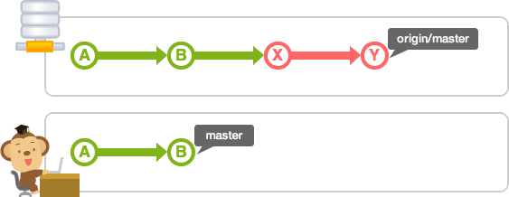
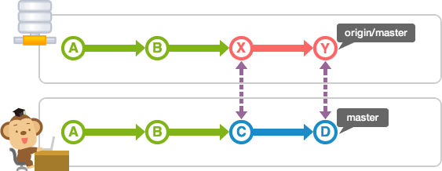

# Phân biệt git fetch vs git pull
---
## Git fetch

Thao tác tải kiểm tra các thay đổi mã nguồn trên remote repository
> Fetch không cập nhật các thay đổi mới vào mã nguồn hiện tại.

Fetch được xem là phương pháp kiểm tra thay đổi trên remote repository.

## Git pull
Sử dụng để update lại branch hiện tại với các thay đổi mới trên remote repository.

Khi thực hiện pull, thao merge sẽ tự động diễn ra, update nội dung của remote repository tới mã nguồn local

__Trước khi pull__

__Sau khi pull__

## Mô hình tổng quan so sánh git fetch vs git pull

