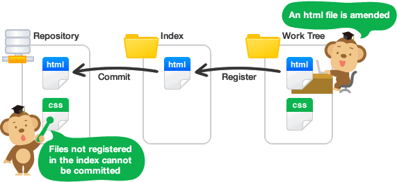
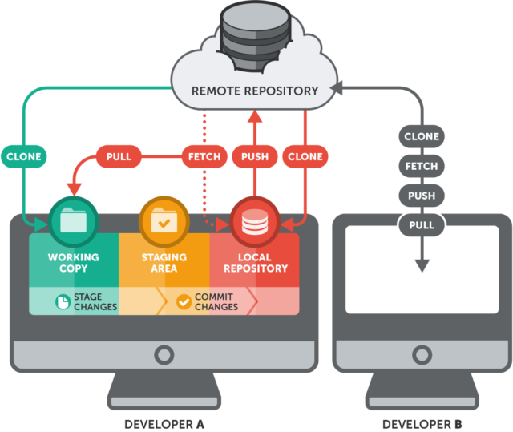
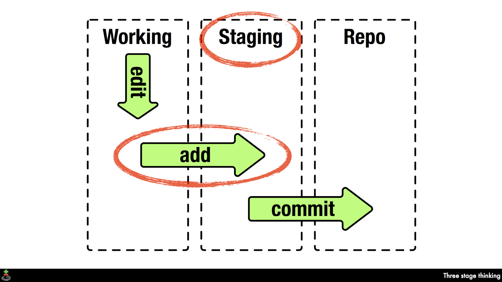
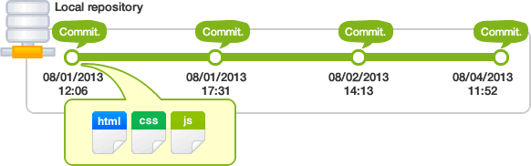

# Các thuật ngữ cơ bản trong git
---
## Kho Repo (Repository)
`Repository` hay được gọi tắt là `Repo`, đơn giản là nơi `chứa` tất cả những `thông tin` cần thiết để `duy trì` và `quản lý` các `sửa đổi` và `lịch sử` của toàn bộ `project`.

Repo có 2 cấu trúc dữ liệu chính:
- Object Store
- Index.

> Tất cả dữ liệu của Repo đèu được chứa trong thư mục bạn đang làm việc dưới dạng folder ẩn có tên là .git

## Working Tree và Index

Thư mục được đặt trong sự quản lý của Git mà mọi người đang thực hiện công việc trong thực tế được gọi là working tree.

Và trên Git, giữa repository và working tree tồn tại một nơi gọi là index. Index là nơi để chuẩn bị cho việc commit lên repository.

## Remote repository và local repository
Git được phân thành 2 loại là remote repository và local repository:
- Remote repository: Là repository để chia sẻ giữa nhiều người và bố trí trên server chuyên dụng.
- Local repository: Là repository bố trí trên máy của bản thân mình, dành cho một người dùng sử dụng

## Nhánh (Branch)
> Tính năng nổi bật của git là nhánh.

Với git, việc quản lý nhánh rất dễ dàng. Mỗi nhánh trong Git gần giống như một workspace. Việc nhảy vào một nhánh để làm việc trong đó tương tự việc chuyển qua ngữ cảnh làm việc mới, và sau đó có thể nhanh chóng quay lại ngữ cảnh cũ.

> Nhánh master là nhánh “mặc định” khi bạn tạo một repository. Thông thường là nhánh chính của ứng dụng.

## Trộn (Merge)
Trộn source từ một nhánh khác vào nhánh hiện tại.

Lưu ý:
- Kiểm tra branch hiện đang làm việc trước khi merge
- Phải đẩy tất cả những thay đổi dưới máy local lên Git trước khi merge
- Trước khi merge phải lấy hết những thay đổi mới nhất của các branch khác, - hay ít nhất là branch cần merge về máy
- Merge thành công thì nên đẩy source lên lại lên server
- Nên merge bằng GUI tool.

## Xung đột (Conflict)
`Conflic` là trường hợp có 2 sự thay đổi trong một dòng code và máy tính không thể tự quyết định dòng code nào là “đúng”.

> Đúng ở đây có nghĩa là “ý đồ của lập trình viên”.

Để giải quyết mâu thuẫn bạn phải dùng “tay không” để sữa các xung đột này. Bạn chỉ việc nhìn vào file bị conflict và tự quyết định dòng code nào giữ lại, dòng nào xóa bỏ.

## Commit
Thao tác ghi lại việc thêm/thay đổi file hay thư mục vào repository thì sẽ thực hiện thao tác gọi là `Commit`.

Khi thực hiện commit, trong repository sẽ tạo ra commit (hoặc revision) đã ghi lại sự khác biệt từ trạng thái đã commit lần trước với trạng thái hiện tại.

Commit này đang được chứa tại repository, các commit nối tiếp với nhau theo thứ tự thời gian. Bằng việc lần theo commit này từ trạng thái mới nhất thì có thể biết được lịch sử thay đổi trong quá khứ hoặc nội dung thay đổi đó.

## Git Remote
Ứng dụng trong trường hợp làm việc với nhiều repo cùng 1 thời điểm

Trên thực tế khi làm việc với nhau thì không như vậy, vì không phải máy ai cũng cài một “git server” để người khác kết nối được với mình. Thông thường thì chúng ta sẽ sử dụng một repo chung và các máy kết nối vào repo đó.

VD: 1 repo được lưu trên cả github.com và bitbucket.org. => repo có 2 remote github và bitbucket

## Nguồn

https://blog.duyet.net/2015/04/git-va-cac-khai-niem-co-ban.html#.WtQQBIhubtQ
